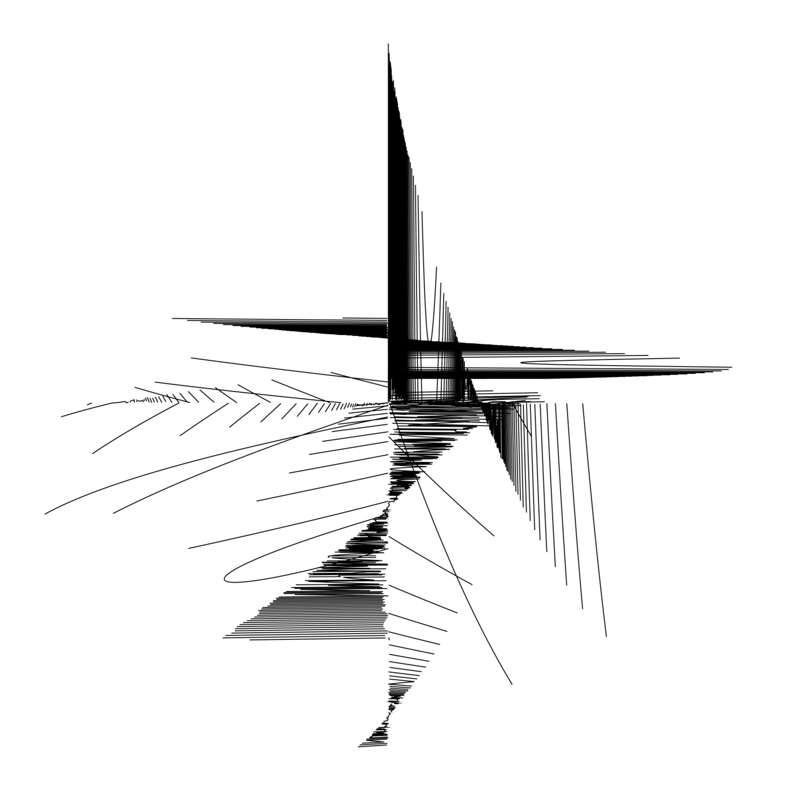
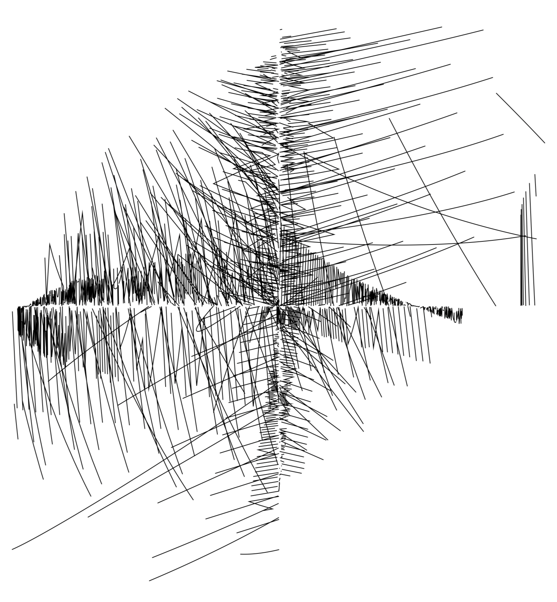
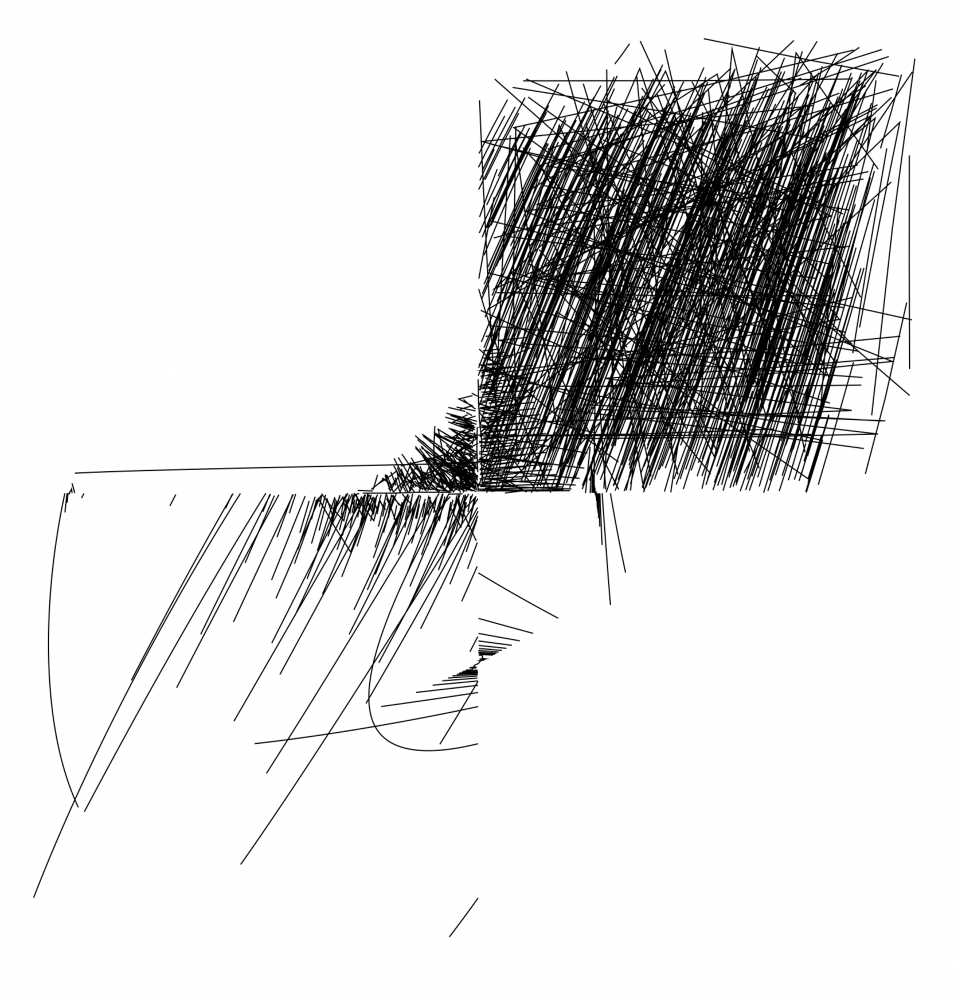

$$
\left[ \begin{array}{c} x \\ y \end{array} \right]=\left[ \begin{array}{c} \sin \left( \pi t \right) \% \cos \left( et \right) \\ \cos \left( et \right)\% \sin \left( \pi t \right) \end{array} \right],\; t=-e…\pi
$$

---

$$
\left[ \begin{array}{c} x \\ y \end{array} \right]=\left[ \begin{array}{c} \sin \left( t^{e}\; \%\; \sin \left( \pi t \right) \right) \\ \sin \left( t^{-e}\; \%\; \cos \left( et \right) \right) \end{array} \right],\; t=-e…\pi
$$

---

$$
\left[ \begin{array}{c} x \\ y \end{array} \right]=\left[ \begin{array}{c} \sin \left( t^{e}\; \%\; \cos \left( \pi t \right) \right) \\ \sin \left( t^{\pi }\; \%\; \cos \left( et \right) \right) \end{array} \right],\; t=-e…\pi
$$

---

$$
\left[ \begin{array}{c} x \\ y \end{array} \right]=\left[ \begin{array}{c} \sin \left( t^{-e}\; \%\; \cos \left( \pi t \right) \right) \\ \sin \left( t^{-\pi }\; \%\; \cos \left( et \right) \right) \end{array} \right],\; t=-e…\pi
$$

---
$$
\left[ \begin{array}{c} x \\ y \end{array} \right]=\left[ \begin{array}{c} \sin \left( t^{-e} \right) \\ \sin \left( t^{-\pi }\; \%\; \cos \left( et \right) \right) \end{array} \right],\; t=-e…\pi
$$

---

$$
\left[ \begin{array}{c} x \\ y \end{array} \right]=\left[ \begin{array}{c} \sin \left( \cos t\left( e^{t} \right)e^{t} \right) \\ \cos \left( t \right) \end{array} \right],\; t=-e…\pi 
$$

